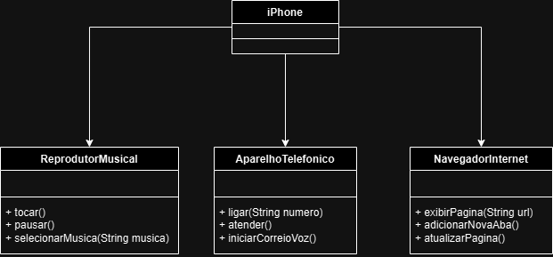

# Modelando o iPhone com UML

Esse desafio foi proposto na formação de java na plataforma da Digital Innovation One (DIO).

### Link do desafio
https://github.com/digitalinnovationone/trilha-java-basico/tree/main/desafios/poo

### Diagrama UML
